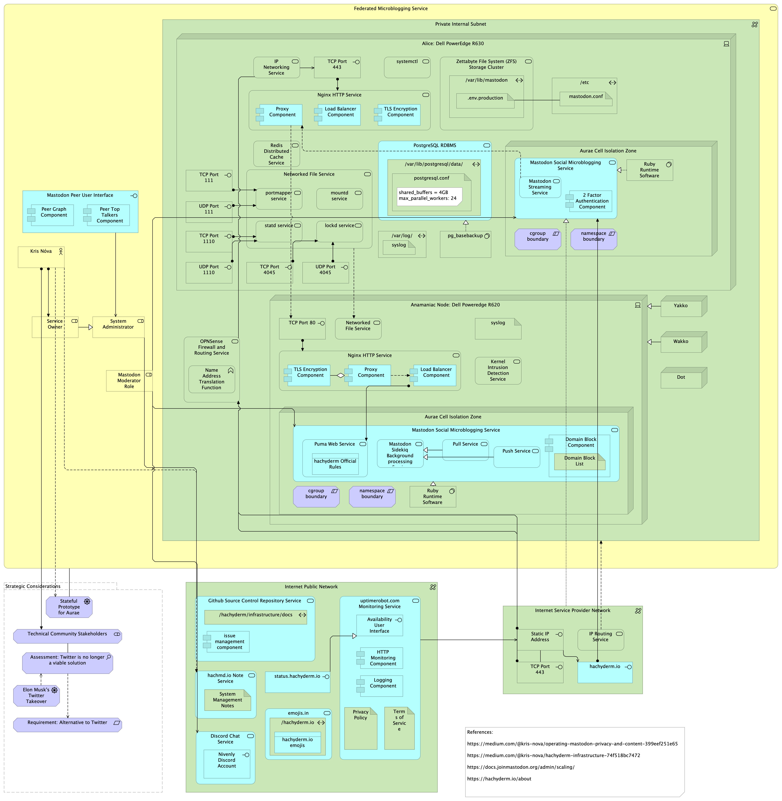

# Hachyderm Enterprise Architecture

## Introduction

Kris Nóva owns and operates a Mastodon microblogging service at [Hachyderm.io](https://hachyderm.io)

Nóva provides insight into the architecture and operation of the site at [her blog](https://medium.com/@kris-nova)

This repository is an aggregation of the hachyderm architecture details that Nóva provides and observation of operations from the perspective of a user @hachyderm.io.

Feedback is requested, if you are inclined.

## Enterprise Architecture

## November 2022 Baseline

## Why Archimate?

Whenever I need a diagram of a system I prefer to build a model as a side effect. As more diagrams are required, the details of the system accumulate within the model.

Over the years I have tried a variety of tools and methods for modeling/diagramming. At the moment I rely on Archimate and PlantUML for most architecture/design.

For me, the purpose of an architecture model is to answer any and all legitimate questions about the system for anyone acting in a role associated with it. The more maintainable the model, the quicker I can respond with answers.

### Advantages Over Diagrams

Here is an incomplete list, in no particular order:

1. You accumulate template objects as you go. They can be used in the next diagram
2. The architecture file is plain text. I can apply source control, grep, and other tools.
3. The editor is free. This makes it accessible to colleagues
4. Looking out for N+1. The next architect can pick up where I left off using a documented standard.
5. Maintainability. Big changes to the architecture lead to small changes in the architecture model.
6. A variety of views. One model can yield conceptual, baseline, target, transitional, details, technical, data, application, business or other diagrams.
7. Simplicity. No sifting through template libraries looking for the right stencil. Archimate identifies architecture elements generically. Your metadata explains from there.
8. Objects, not pictures. Change an object's relationship in one view, and the other views are updated. You can check the changes by looking at the analysis view, which gives you a list of views the element is used in.
9. Association graphs. Find out what parts of your architecture depend on a library, piece of hardware, business process, etc.

## References

1. https://medium.com/@kris-nova/operating-mastodon-privacy-and-content-399eef251e65
2. https://medium.com/@kris-nova/hachyderm-infrastructure-74f518bc7472
3. https://docs.joinmastodon.org/admin/scaling/
4. https://hachyderm.io/about

